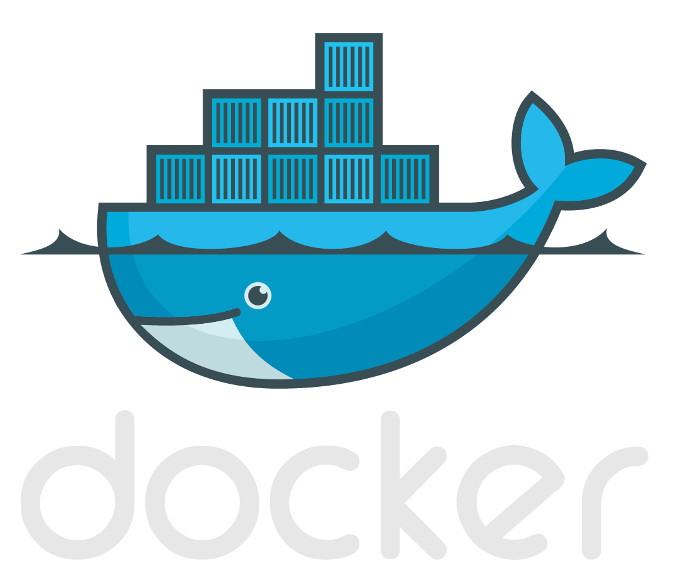
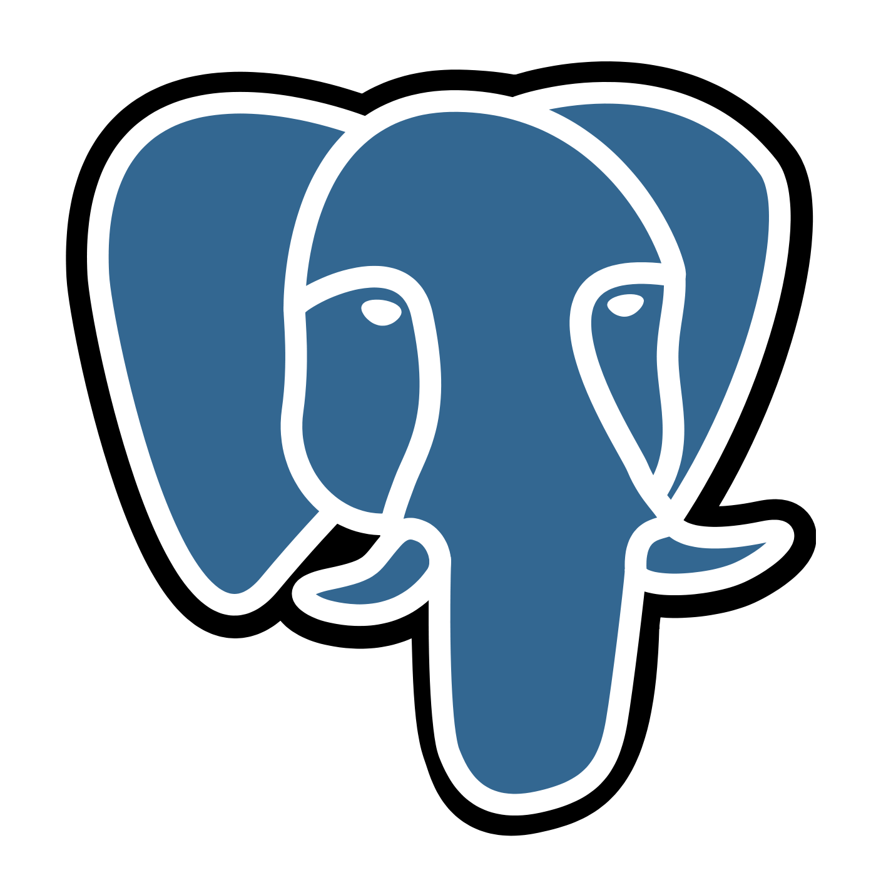
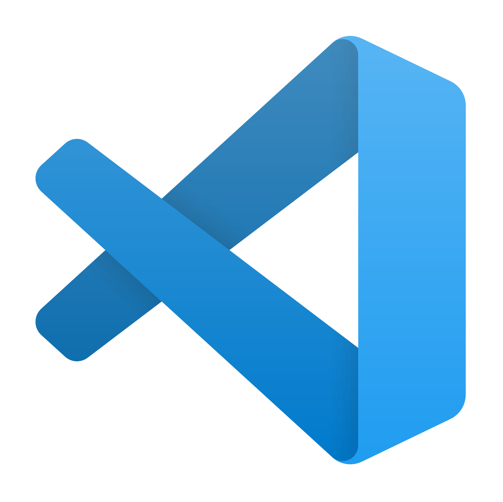

Hi 👋 My name is Egon Saks  

I am a full-stack software development student at [kood/Jõhvi](https://kood.tech).

I love working with Go and Javascript, but I'm happy to learn new technologies and use whatever tool is most suited for the job. My favorite daily activities are learning new things and building cool stuff, either on my own or with a team!

Recently, I worked with Node.js, Typescript, React, and Next.js, explored new projects during my free time. I am interested in expanding my skill set to include other technologies and frameworks.

Currently, I am working on Cloud DevOps specialization and looking also into Networking and Cybersecurity while many things are interconnected.

Previously, I've done a bunch of cool stuff in different domains. I was fortunate to work for over 10 years in operations in tech startups across various industries in Europe and North America, ranging from small startups to unicorn. Discovering the unknown, working on very interesting problems and challenges, learning most things on the go has made me resilient and changed my life more than anything else.

Working in closely with developers and seeing how they make magic happen inspired me to get my hand dirty. I built some python and bash scripts to automate my tasks, it was fascinating to see the impact these scripts had for my workflow and efficiency so I decided to immerse myself fully in the world of software development.

This extensive hands-on experience has equipped me with a strong understanding of business processes and user needs, positioning me uniquely to develop software solutions that are not only technically sound but also align closely with business objectives and create customer value.

I am naturally curious and proactive, with good communication skills and a never-ending hunger to grow and learn. I have a strong bias towards action and a "get it done" mentality. I am result-driven with a "can-do, I will figure it out" attitude. I am a builder and problem solver at heart, and I love everything related to tech.

I love working with awesome people, preferably in a small team where I can make an impact quickly.

If you are hiring, let's chat!
  
#### [LinkedIn](http://www.linkedin.com/in/egonsaks/) | [Website](https://www.egonsaks.com)

---

### Languages & Tools

 <a href="https://www.javascript.com" target="_blank" rel="noreferrer"> <a href="https://html.com/html5/" target="_blank" rel="noreferrer">        

---

📈 My GitHub Stats

 

