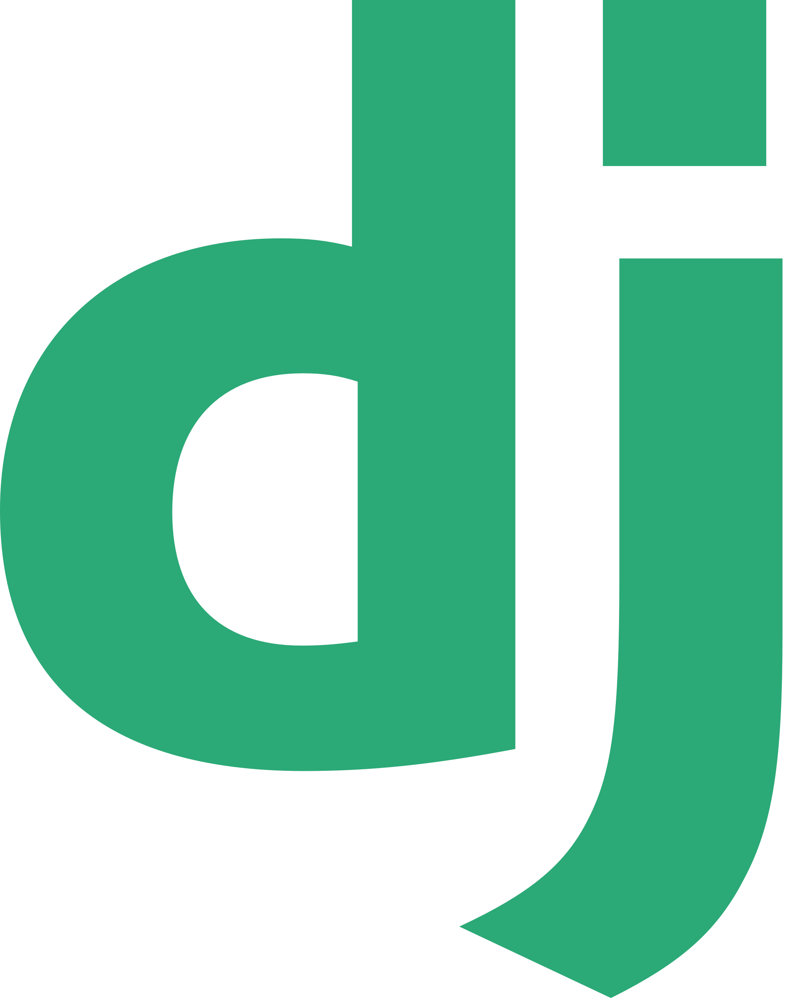

Hi 👋 My name is Egon Saks  

👨‍💻 I'm software development and engineering student at [kood/Jõhvi](https://kood.tech) and looking to gain some real world experience in software development as a full stack developer. I am analytical, data driven and quick learner. I love everything around tech. 

Previously, I have worked for over 10 years on operations in tech startups across various industries in Europe and North America. This extensive experience has equipped me with a deep understanding of business needs and operational efficiencies. I bring a business-centric perspective to software development. Walking between two worlds makes me a unique asset in bridging the gap between technical and non-technical stakeholders.

I am resourceful and aim to make an impact by driving business value through code. I enjoy working with small and agile teams to launch and grow innovative products and services. My goal is to contribute to launching and scaling groundbreaking products and services that meet both user needs and business objectives.
  
#### [LinkedIn](http://www.linkedin.com/in/egonsaks/) | [Website](https://www.egonsaks.com)

---

### Languages & Tools

 <a href="https://www.javascript.com" target="_blank" rel="noreferrer"> <a href="https://html.com/html5/" target="_blank" rel="noreferrer">        

---

📈 My GitHub Stats

 

